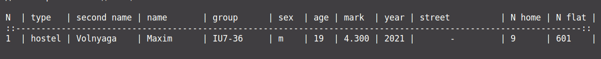
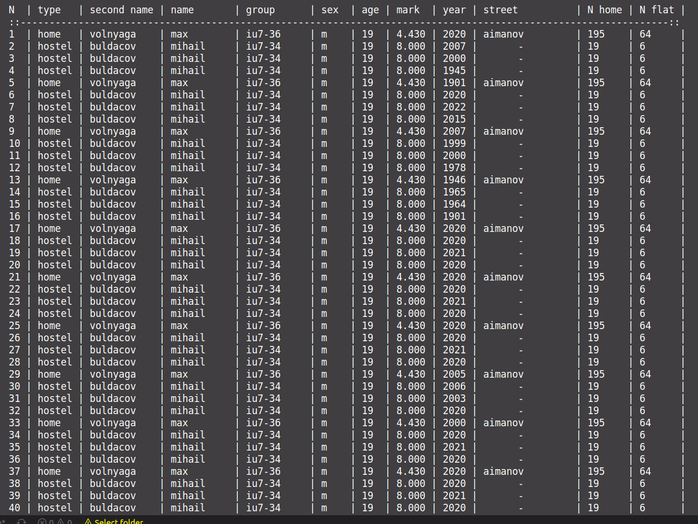
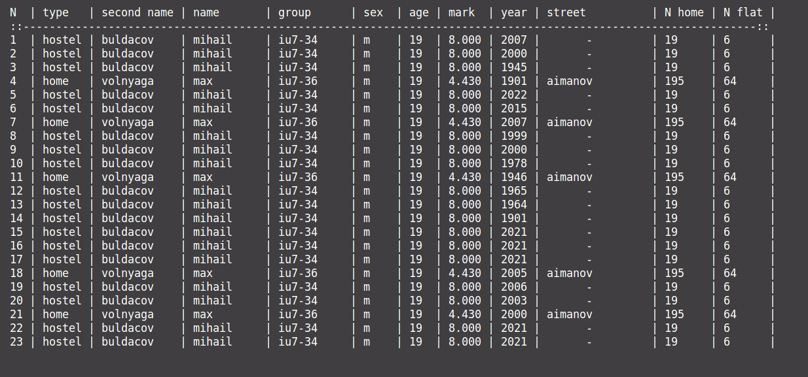
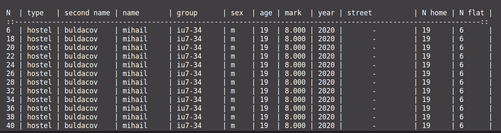
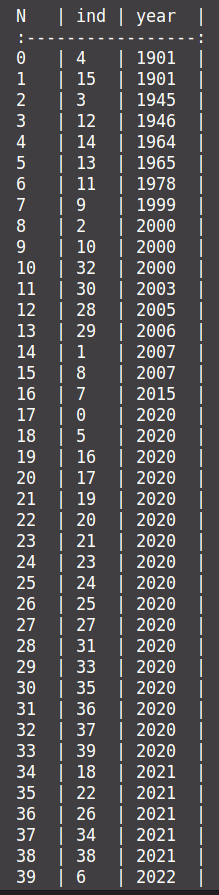
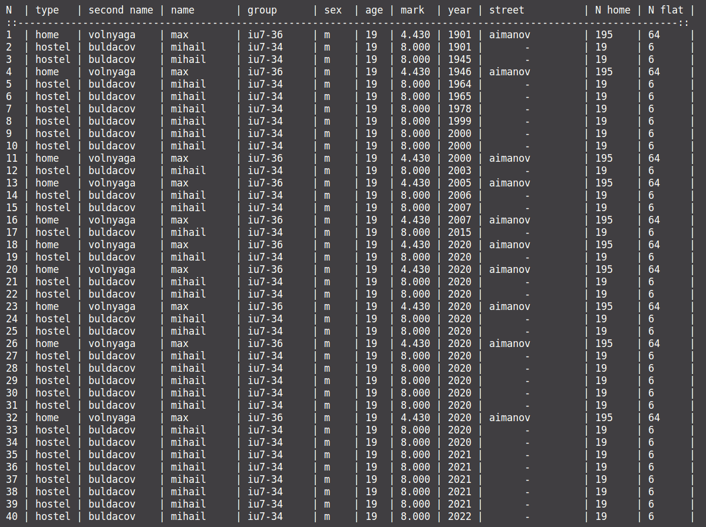

<!-- pandoc --pdf-engine=context -V mainfont="CMU Serif" -V monofont="CMU Typewriter Text"  -V geometry:a4paper -V documentclass=article -o report_Volnyga_Maxim_IU7-36.pdf markdown.md -->
### Описание условия

Type жилье = (дом, общежитие);

Данные:

Фамилия, имя, группа, пол (м, ж), возраст, средний балл за сессию, дата поступления адрес:

дом: (улица, №дома, №кв);

общежитие: (№общ., №комн.);

Ввести общий список студентов.
Вывести список студентов, указанного года поступления, живущих в общежитии

### Описание ТЗ
#### Описание исходных данных и результатов:
(типы, форматы, точность, способ передачи, ограничения)
Программа получает на вход:

Целое число для выбора ввода меню, файл(см. описание задачи, меню) при выборе ввода вручную  вводится целое число без знака для указания
кол-ва студентов далее 

1) Тип жилья вводится латинскими буквами и необходимо выбрать home - дом или hostel - общежитие
2) Фамилия вводится только латинскими буквами
3) Имя вводится только латинскими буквами
4) Группа вводится латинскими буквами и может содержать цифры, или другие символы
5) Гендер может содержать только m - мужской или f - женский
6) Возраст вводится целыми без знаковыми числами и должен быть больше 1 и меньше 150 лет
7) Средний балл вводится в вещественном формате может иметь только одну точку не в начале числа
8) Год поступления вводится целым без знаковым числом и должен быть больше 1900 и меньше 2024 года
9) Если выбран тип жилья - home, то вводится улица дома, номер дома -  целое без знака число,  квартира - целое беззнаковое число
10) Если выбран тип жилья - hostel, то вводится номер общежитии - целое без знака число, номер комнаты - целое без знака число 
11)  Для выбора меню вводятся числа от 0 до 9
12)  Все поля вводятся без пробелов, максимальная строка ввода = 127

Вывод результата: 

Исходная таблица студентов, сортированная таблица студентов, исходная таблица студентов отсортированная по таблице ключей, таблица ключей отсортированная, результат эффективности, результат сравнения различных алгоритмов сортировок

#### Описание задачи, реализуемой программой
Меню: 

программа предоставляет работу со структурой данных с выборным  меню. Удаляет запись из структуры, добавляет запись в конец структуры, выводит определенную группу студентов, сортирует по определенному полю при помощи структуры ключей и исходной структуры, выводит структуру в виде таблица, выводит структуру ключей, выводит результат эффективности работы с структурой ключей  в процентном соотношение, выводит результат использования различных алгоритмов сортировок в виде таблицы, выводит информационное сообщение.

#### Способ обращения к программе
Обращение к программе происходит путём консольного ввода и / или файла.

#### Описание возможных аварийных ситуаций и ошибок пользователя
Аварийные ситуации:
1. Ввод место целого числа строки, пустой строки, строки с пробелом, другие различные символы включая знак числа.
2. Ввод строки с пробелом либо пустой строки
3. При заполнение структуры если возврат студента меньше 1 или больше 150
4. При заполнение структуры если год поступления больше 2023 или меньше 1900
5. При Вводе не корректного среднего балла должно быть либо целым либо иметь одну точку не в начале числа и без знака

### Описание внутренних СД
### Структура исходной таблицы
```c
#define MAX_LEN_STR 128
#define MAX_STDNT 1000

typedef enum type_home
{
    HOME,
    HOSTEL
} type_home_t;

typedef struct inf_stdnt
{
    char type_home[MAX_LEN_STR];
    type_home_t item_home;

    char second_name[MAX_LEN_STR];
    char name[MAX_LEN_STR];
    char group[MAX_LEN_STR];
    char gender[MAX_LEN_STR];
    int age;
    double avg_mark;
    int year_admission; 

    union
    {
        struct
        {
            char street[MAX_LEN_STR];
            int home;
            int flat;
        } home_t;
        struct
        {
            int number_hostel;
            int room;
        } hostel_t;
    } adress_u;

} inf_stdnt_t;
```
### Структура ключей
```c
typedef struct key_tables
{
    int index;
    int year_admission;
} key_tables_t;

```
### Описание алгоритма

Основные алгоритмы - сортировки, используется обычный пузырек и быстрая сортировка - мердж сортировка

Алгоритм обмена реализован при помощи копирования структур с сохранением одной структуры в память

Алгоритм удаления одной структуры в массиве структур реализован смещением всех структур после удаляемой и уменьшением количеством элементов в массиве

Добавление Записи в конец массива структур реализован при помощи увеличения количества элементов и записи в массив

Вывод структуры по структуре ключей реализован при помощи сортировки ключей, где записаны индексы полей и сортируемая строка, в моем случае год поступления, после сортировки данной структуры происходит вывод исходной структуры по индексу поля структруры ключей.


### Набор тестов с указанием проверямого параметра

| Ввод                                                                                                                                                                                                                                                                                            | Вывод                                                                                                    | Что                           |
| ----------------------------------------------------------------------------------------------------------------------------------------------------------------------------------------------------------------------------------------------------------------------------------------------- | -------------------------------------------------------------------------------------------------------- | ----------------------------- |
| пустой ввод в меню                                                                                                                                                                                                                                                                              | Вы ввели не целое число для выбора                                                                       | пустой ввод в меню            |
| ввод в меню не целого числа                                                                                                                                                                                                                                                                     | Вы ввели не целое число для выбора                                                                       | не коректный  ввод в меню     |
| при вводе поля (тип жилья) строка отлична от  home или  hostel (erg, 4, hof m)                                                                                                                                                                                                                  | Ошибка введено не верный тип жилья  home или hostel                                                      | не вверный ввод типа жилья    |
| при вводе поля (фамилия) строка содержит пробел не допустимые символы или пустая (volnyaga Maxim, Voln+y464aga)                                                                                                                                                                                 | Ошибка введено не верная фамилия, в фамилии не должно быть символов отличных от символов англ яз         | не вверный ввод фамилии       |
| при вводе поля (имя) строка содержит не допустимые символы либо пустая (Volnyaga Max, Ma342x)                                                                                                                                                                                                   | Ошибка введено не верная имя, в имя не должно быть символов отличных от символов англ яз                 | не вверный ввод имя           |
| при вводе поля (группа) строка имеет пробел или пустая (iu 7)                                                                                                                                                                                                                                   | Ошибка введено не верная группа, в группе не должно быть пробелов                                        | не вверный ввод группы        |
| при вводе поля (гендер) любая строка отличная от m или f (mf, fm)                                                                                                                                                                                                                               | Ошибка введено не верный пол, пол либо m либо f                                                          | не вверный ввод гендера       |
| при вводе поля возвраст строки (ergewrg), (+4), (4.4) пустой ввод                                                                                                                                                                                                                               | Ошибка введено не верный возраст, возраст либо от 1 до 150                                               | ошибка ввода возвраста        |
| При вводе поля (среднего балла) число содержит две или больше точек, число содержит первый символ точка, число содержит знак, число сожержит отличные от цифр символы (123.13.23 , .123, +123.13, 132 456, 13кв2)                                                                               | Ошибка введено не верный средний балл, балл должен быть вещественный и может содержать только одну точку | Ошибка ввода среднего балла   |
| При вводе поля (года поступления) число имеет знак, точку, другие символы не цифры, год меньше 1900 либо больше 2023 (2024, 1899, 46укп465, +2022)                                                                                                                                              | Ошибка введено не верный год, год должен быть больше 1900 и меньше 2023                                  | Ошибка ввода года поступления |
| При вводе поля (улица) пустой ввод либо строка с пробелом (Аймано ва)                                                                                                                                                                                                                           | Ошибка введено не верная улица, улица не может содержать пробелов                                        | Ошибка ввода улицы            |
| При вводе поля (номер дома) число не целое, имеет знак, имеет не допустимые сиволы (12ыа3,+123,123.13,123 1)                                                                                                                                                                                    | Ошибка введено не верный номер дома, номер должен быть целым и не содержать знака                        | Ошибка ввода номера дома      |
| При вводе поля (номера квартиры)  номер должен быть целым и не содержать знака (12ыа3,+123,123.13,123 1)                                                                                                                                                                                        | Ошибка введено не верный номер квартиры, номер должен быть целым и не содержать знака                    | пустой ввод в меню            |
| Ведите кол-во студентов: 1  Введите тип жилья(home or hostel):hostel  Введите фамилию:Volnyaga Введите имя:Maxim Введите группу:IU7-36 Введите гендер:m Введите возвраст:19 Введите средний балл студента:4.3 Введите год поступления:2021 Введите номемр общажития:9 Введите номер комнаты:601 | таблица из одго студента                                             | обычный  тест                 |
### Проверка удаления студента

исходная таблица




После удаления студентов имеющие год поступления 2020





### Проверка Вывода списока студентов, указанного года поступления, живущих в общежитии



### Проверка сортировки таблицы ключей



### Проверка сортировки сходной таблицы



### Проверка сортировки сходной таблицы с использованием таблицы с ключами


## Выводы

### Оценка эффективности

Одна исходная структура занимает 800 байт с выравниванием, структура ключа занимает 8 байт, следовательно структура ключей увеличила объем на 1% 


результат использования различных алгоритмов сортировок для 40 элементов

| 40  | merge sort key | buble sort key | merge sort struct | buble sort struct |
| --- | -------------- | -------------- | ----------------- | ----------------- |
| mc  | 40             | 81             | 237               | 366               |

результат использования различных алгоритмов сортировок для 100 элементов


| 100 | merge sort key | buble sort key | merge sort struct | buble sort struct |
| --- | -------------- | -------------- | ----------------- | ----------------- |
| mc  | 99             | 266            | 703               | 894               |

результат использования различных алгоритмов сортировок для 500 элементов


| 500 | merge sort key | buble sort key | merge sort struct | buble sort struct |
| --- | -------------- | -------------- | ----------------- | ----------------- |
| mc  | 345            | 7218           | 3226              | 50132             |

результат использования различных алгоритмов сортировок для 1000 элементов


| 1000 | merge sort key | buble sort key | merge sort struct | buble sort struct |
| ---- | -------------- | -------------- | ----------------- | ----------------- |
| mc   | 876            | 17416          | 8254              | 253858            |


Можно сделать несколько выводов. Во–первых, быстрая сортировка действительно гораздо эффективнее, чем сортировка пузырьком, разность в скорости сортировок существенен при больших массивов 

Во–вторых, таблица оказалась крайне эффективным средством. В обоих сортировках вариант с таблицей был в 3–4 раза эффективнее, но с увеличением N разница уменьшается, что связано с большим количеством обменов, так что такое поведение естественно

Подводя итог: таблица сократило время работы программы на 50–70%, а быстрая сортировка позволяет уменьшить время на 40–60%, но проценты растут пропорционально N, поэтому точное число назвать нельзя.

### Выводы по проделанной работе

Для хранения баз данных отлично подойдёт тип данных «запись», но корректную работу должен обеспечивать программист, особенно если дело касается вариантных полей. Получилось, что быстрая сортировка при больших N действительно гораздо эффективнее, чем сортировка пузырьком. Таблица даёт существенный выигрыш при сортировке базы данных, так как экономится огромное количество времени на обмене структур между собой, и чем больше полей, тем существенней проявляет себя экономия. Затраты памяти при этом растут пропорционально N, но они не играют большую роль в оценке эффективности программы.

### Ответы на вопросы

Как выделяется память под вариантную часть записи?

Вариантное поле в записи может быть только одно и оно всегда последнее. В свою очередь последнее поле в вариантной части может быть вариантным, то есть вариантное поле так же может быть вложенным.

Объем памяти, необходимый для записи с вариантами складывается из длин полей фиксированной части и максимального по длине поля вариантной части. 
Что будет, если в вариантную часть ввести данные, несоответствующие описанным?

Тип данных в вариантной части при компиляции не проверяется, поэтому, контроль за правильностью ее использования возлагается на программиста. Если эта ситуация не контролируются,то возможно неопределенное поведение.

Кто должен следить за правильностью выполнения операций с вариантной частью записи?

Программист.

Что представляет собой таблица ключей, зачем она нужна?

При больших размерах таблиц поиск данных, имеющих указанный ключ, может потребовать больших затрат времени. Если же помимо поиска требуется произвести сортировку данных, то временные затраты многократно возрастут, так как потребуется осуществлять их перестановку (перемещение). В этом случае можно уменьшить время обработки за счет создания дополнительного массива – таблицы ключей, содержащей индекс элемента в исходной таблице и выбранный ключ.
Если мы сортируем таблицу ключей, то экономится время, поскольку перестановка записей в исходной таблице, которая иногда может содержать достаточно большое число полей, отсутствует.

В каких случаях эффективнее обрабатывать данные в самой таблице, а когда – использовать таблицу ключей?

При больших N и большом количестве полей гораздо выгодней обрабатывать таблицу ключей, в обратном случае затраты на дополнительную память могут быть не оправданы.

Какие способы сортировки предпочтительнее для обработки таблиц и почему?

Самый эффективный способ сортировки – быстрая сортировка, так как зависит от NlogN, при этом использование таблицы ключей позволяет довести временные затраты до минимума.