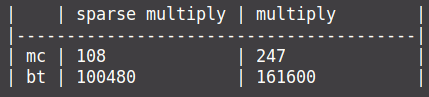

<!-- pandoc --pdf-engine=context -V mainfont="CMU Serif" -V monofont="CMU Typewriter Text"  -V geometry:a4paper -V documentclass=article -o report_Volnyga_Maxim_IU7-36.pdf markdown.md -->
### Описание условия

Разреженная (содержащая много нулей) матрица хранится в форме 3-х объектов:
- вектор A содержит значения ненулевых элементов;
- вектор IA содержит номера строк для элементов вектора A;
- связный список JA, в элементе Nk которого находится номер компонент
в A и IA, с которых начинается описание столбца Nk матрицы A.
1. Смоделировать операцию умножения вектора-строки и матрицы,
хранящихся в этой форме, с получением результата в той же форме.
2. Произвести операцию умножения, применяя стандартный алгоритм работы с
матрицами.
3. Сравнить время выполнения операций и объем памяти при использовании
этих 2-х алгоритмов при различном проценте заполнения матриц.

### Описание ТЗ
#### Описание исходных данных и результатов:
Программа получает на вход:

Целое число для выбора ввода меню, целые числа, задающие количество строк и столбцов матрицы, элементы матрицы и их положение в ней, процент заполненности матрицы.

Вывод результата: 

Исходные вектор-строка и матрица в разреженном или стандартном виде. Матрица строка результат умножения. Таблица сравнения эффективности.

#### Описание задачи, реализуемой программой
Меню: 

Программа предоставляет работу с матрицами. Ввод матрицы и вектор-строки с клавиатуры. Генерация разреженной матрицы и вектора-строки по заданным размерам матрицы и проценту её заполненности. Вывод  матриц на экран в разреженном или стандартном виде. Вывод результата операции умножения исходных матриц. Вывод таблицы сравнения эффективности.

#### Способ обращения к программе
Обращение к программе происходит путём консольного ввода.

#### Описание возможных аварийных ситуаций и ошибок пользователя
Аварийные ситуации:
1) Некорректный ввод пункта меню.
2) Некорректный ввод целочисленных данных.
3) Попытка вывода или выполнения операции умножения без ввода/генерации исходных матриц.

### Описание внутренних СД
### Структура исходной таблицы

```c

// Структура для хранения размеров матрицы
typedef struct
{
    int rows;     //Количество строк
    int columns;  //Количество столбцов
    int nonzeros; //Количество ненулевых элементов
} mtr_size_t;

// Структура матрицы в разреженном виде
typedef struct
{
    mtr_size_t sizes; //Размеры матрицы
    int *elements;       // Указатель на массив элементов матрицы
    int *rows;           // Указатель на массив строк, соответствующих элементам
    int *columns;        // Указатель на массив номеров элементов, с которых начинается столбец
} sparse_mtr_t;

//Структура матрицы в стандартном виде
typedef struct
{
    mtr_size_t sizes; //Размеры матрицы
    int **mtr;        //  Матрица
} mtr_t;
```

### Описание алгоритма

При умножение матрицы на вектор - строку в обычном представление, используется стандартный алгоритм умножения матриц, при котором элемент результирующей матрицы С получается из элементов исходных матриц A и B следующим образом: С[i][j] = sum(A[i][k] * B[k][j]) где к - от нуля до n -1

При  матрицы на вектор - строку в разреженном формате производится обход по  матрице с номерами компонента вектора элементов и вектора их строк, ищется непустой столбец, после нахождения происходит поиск номер элемента, на котором этот столбец заканчивается, поочередно выбираются элементы, соответствующие данному столбцу, умножаются на элементы вектора-строки в столбцах, номер которых совпадает с номером строки элемента матрицы, и добавляются в сумму. После нахождения суммы записывается в результирующую матрицу.


### Набор тестов с указанием проверямого параметра

| Ввод | Вывод | Что|
| ----------------------------------------------------------------------------------------------------------------------------------------------------------------------------------------------------------------------------------------------------------------------------------------------- | -------------------------------------------------------------------------------------------------------- | ----------------------------- |
| qwe |  ВВеденное число не соответствует ни одному действию код ошибки =  1 | Проверка ввода меню - строка|
| пустой ввод |  ВВеденное число не соответствует ни одному действию код ошибки =  2 | Проверка ввода меню  - пустая строка |
| 11 |  ВВеденное число не соответствует ни одному действию код ошибки =  1 | Проверка ввода меню - выход из диапазона |
| -78 |  ВВеденное число не соответствует ни одному действию код ошибки =  1 | Проверка ввода меню - выход из диапазона |
| qwe  |  Ошибка при чтении числа, код ошибки =  4 | Проверка ввода размерности строки для матрицы - строка |
| -2  |  ОШИБКА Введенное значение выходит за допустимый диапазон значений , код ошибки =  5 | Проверка ввода размерности строки для матрицы - выход из диапазона  |
| qwe  |  Ошибка при чтении числа, код ошибки =  4 | Проверка ввода размерности столбца для матрицы - строка |
| -2  |  ОШИБКА Введенное значение выходит за допустимый диапазон значений , код ошибки =  5 | Проверка ввода размерности столбцов для матрицы - выход из диапазона  |
| 10  | ОШИБКА Количество ненулевых элементов больше количества элементов в матрице код ошибки =  3 | Проверка ввода кол-ва не нулевых элементов матрицы - выход из диапазона |
| -10  | ОШИБКА Количество ненулевых элементов больше количества элементов в матрице код ошибки =  3 | Проверка ввода кол-ва не нулевых элементов матрицы - выход из диапазона |
| WE  | ОШИБКА Количество ненулевых элементов больше количества элементов в матрице код ошибки =  3 | Проверка ввода кол-ва не нулевых элементов матрицы - строка  |
| erer wef wef  |  ОШИБКА Заданы Неверные  параметры элемента матрицы, код ошибки =  11 | Проверка ввода элементов матрицы - строка +строка + строка |
| erer 1 0 |  ОШИБКА Заданы Неверные  параметры элемента матрицы, код ошибки =  11 | Проверка ввода элементов матрицы - строка +  число + число |
| 1 йцу 0 |  ОШИБКА Заданы Неверные  параметры элемента матрицы, код ошибки =  11 | Проверка ввода элементов матрицы - число +  строка + число |
| 1 1 ццу |  ОШИБКА Заданы Неверные  параметры элемента матрицы, код ошибки =  11 | Проверка ввода элементов матрицы - число +  число + строка |
| 1 10 1 |  ОШИБКА Заданы Неверные  параметры элемента матрицы, код ошибки =  11 | Проверка ввода элементов матрицы - выход из диапазона столбцов |
| 1 1 строка|  ОШИБКА Заданы Неверные  параметры элемента матрицы, код ошибки =  11 | Проверка ввода элементов матрицы - ввод строки элемента в матрицу |
| 10  1 |  ОШИБКА Заданы Неверные  параметры элемента матрицы, код ошибки =  11 | Проверка ввода вектора - выход из диапазона |
| 10  |  ОШИБКА Заданы Неверные  параметры элемента матрицы, код ошибки =  11 | Проверка ввода вектора - пропуск элемента вектора |
| 10  вцв |  ОШИБКА Заданы Неверные  параметры элемента матрицы, код ошибки =  11 | Проверка ввода вектора - ввод строки в элемент вектора |
| йцу  1 |  ОШИБКА Заданы Неверные  параметры элемента матрицы, код ошибки =  11 | Проверка ввода вектора - ввод строки в индекс элемента |
| 1000 |  ОШИБКА Процент -- целое число от 0 до 100, код ошибки =  13 | Проверка ввода процента - заполняемости выход за диапазон |
| -1000 |  ОШИБКА Процент -- целое число от 0 до 100, код ошибки =  13 | Проверка ввода процента - заполняемости выход за диапазон |
| строка |  Ошибка при чтении числа, код ошибки =  4 | Проверка ввода процента заполняемости - строка |
| 1 |  ОШИБКА При заполнение матриц одна из матриц пустая, код ошибки =  12 | Проверка ввода процента заполняемости - маленький процент  |
| Исходная матрица: 1 строка \0     15     23  \ 2 строка  28      2      0 \ 3 строка  10     -5      0  Исходный вектор-строка: 0      2     23  | Результат умножения вектора-строки на матрицу: 286   -111      0   | Проверка умножения матрицы и вектора стандартный алгоритм  |
| Исходная матрица: 1 строка \0     15     23  \ 2 строка  28      2      0 \ 3 строка  10     -5      0  Исходный вектор-строка: 0      2     23  | Значения элементов: 286   -111  \Индекс строк этих элементов: 0      0  \Индекс элемента, с которого начинается j-ый столбец: 0      1     -1 | Проверка умножения матрицы и вектора  алгоритмом обработки разреженных  |
| 200 строк и 200 столбцов |  | Проверка вывода таблицы эффективности |

## Оценка эффективности

Процент заполненности 10%: матрица 10x10 
|    | sparse multiply | multiply        |
|----|-----------------|-----------------|
| mc | 0               | 2               |
| bt | 216             | 480             |

Процент заполненности 10%: матрица 100x100
|    | sparse multiply | multiply        |
|----|-----------------|-----------------|
| mc | 14              | 65              |
| bt | 9872            | 40800           |


Процент заполненности 10%: матрица 1000x1000
|    | sparse multiply | multiply        |
|----|-----------------|-----------------|
| mc | 452             | 4111            |
| bt | 820800          | 4008000         |

Процент заполненности 30%: матрица 10x10
|    | sparse multiply | multiply        |
|----|-----------------|-----------------|
| mc | 1               | 1               |
| bt | 440             | 480             |

Процент заполненности 30%: матрица 100x100
|    | sparse multiply | multiply        |
|----|-----------------|-----------------|
| mc | 37              | 68              |
| bt | 26240           | 40800           |

Процент заполненности 30%: матрица 1000x1000
|    | sparse multiply | multiply        |
|----|-----------------|-----------------|
| mc | 2054            | 4431            |
| bt | 2422400         | 4008000         |

Процент заполненности 50%: матрица 10x10
|    | sparse multiply | multiply        |
|----|-----------------|-----------------|
| mc | 1               | 2               |
| bt | 632             | 480             |

Процент заполненности 50%: матрица 100x100
|    | sparse multiply | multiply        |
|----|-----------------|-----------------|
| mc | 57              | 49              |
| bt | 42400           | 40800           |

Процент заполненности 50%: матрица 1000x1000
|    | sparse multiply | multiply        |
|----|-----------------|-----------------|
| mc | 4467            | 4362            |
| bt | 4024000         | 4008000         |

Процент заполненности 70%: матрица 10x10
|    | sparse multiply | multiply        |
|----|-----------------|-----------------|
| mc | 2               | 1               |
| bt | 816             | 480             |

Процент заполненности 70%: матрица 100x100
|    | sparse multiply | multiply        |
|----|-----------------|-----------------|
| mc | 78              | 39              |
| bt | 58560           | 40800           |

Процент заполненности 70%: матрица 1000x1000
|    | sparse multiply | multiply        |
|----|-----------------|-----------------|
| mc | 4742            | 4463            |
| bt | 5625600         | 4008000         |

Процент заполненности 100%: матрица 10x10
|    | sparse multiply | multiply        |
|----|-----------------|-----------------|
| mc | 2               | 2               |
| bt | 1080            | 480             |

Процент заполненности 100%: матрица 100x100
|    | sparse multiply | multiply        |
|----|-----------------|-----------------|
| mc | 86              | 36              |
| bt | 82800           | 40800           |

Процент заполненности 100%: матрица 1000x1000
|    | sparse multiply | multiply        |
|----|-----------------|-----------------|
| mc | 4868            | 4468            |
| bt | 8028000         | 4008000         |

## Выводы

Матрица в разреженном формате размерностью 1*1 с не нулевым элементом  занимает 36 байт с выравниванием, матрица в обычном представлении  занимает 12 байт, следовательно разреженная матрица увеличила объем в 3р

При проценте заполненности, меньшем 50%, алгоритм разреженных матриц выигрывает как по времени, так и по памяти, для любых размерностей матриц. При проценте заполненности, более 50%, такой алгоритм для всех размерностей проигрывает по памяти стандартному алгоритму, так как приходится хранить в 3 раза больше информации. При больших размерностях алгоритм разреженных матриц всегда более эффективен, чем стандартный алгоритм, – так как  скорость доступа к конкретному элементу матрицы быстрее.


### Ответы на вопросы

1. Что такое разреженная матрица, какие схемы хранения таких матриц Вы знаете?
    
    Разряженная матрица — это матрица, содержащая большое количество нулей. 
	Схемы хранения матрицы: связанная схема хранения (с помощью линейных связанных списков),  кольцевая связанная схема хранения, двунаправленные стеки и очереди, диагональная схема хранения, строчной формат, столбцовый формат.

2. Каким образом и сколько памяти выделяется под хранение разреженной и обычной матрицы?
   
	Под обычную матрицу (N – количество строк, M – количество столбцов) выделяет N*M ячеек памяти.
	Для разреженной матрицы количество ячеек памяти завит от способа. В случае разряженного формата требуется количество ячеек в размере К * 3 (К — количество ненулевых элементов, умножаем на 3, так как необходимо 3 списка, для хранения информации об этих элементов).

3. Каков принцип обработки разреженной матрицы?

	При обработке разреженной матрицы мы работаем только с ненулевыми элементами. Тогда количество операций будет пропорционально количеству ненулевых элементов (прямая зависимость).

4. В каком случае для матриц эффективнее применять стандартные алгоритмы обработки матриц? От чего это зависит?
   
	Эффективнее применять стандартные алгоритмы выгоднее при большом количестве ненулевых элементов.
	Стоит отметить, что если расход памяти в программе не так важен, но важно время выполнения программы, то в случае умножения матрицы на вектор столбец лучше воспользоваться стандартным алгоритмом при большом количестве ненулевых элементов, и умножение специального (разряженного) в случае небольшого количества ненулевых элементов.