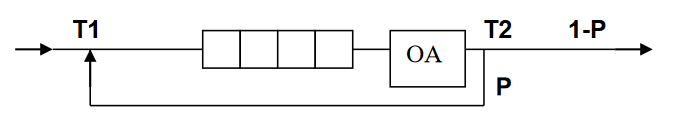

### Описание условия

Вар No5

Система массового обслуживания состоит из обслуживающего аппарата
(ОА) и очереди заявок



Заявки поступают в "хвост" очереди по случайному закону с интервалом
времени Т1, равномерно распределенным от 0 до 6 единиц времени (е.в.). В
ОА они поступают из "головы" очереди по одной и обслуживаются также
равновероятно за время Т2 от 0 до 1 е.в., Каждая заявка после ОА с
вероятностью Р=0.8 вновь поступает в "хвост" очереди, совершая новый цикл
обслуживания, а с вероятностью 1-Р покидает систему (все времена –
вещественного типа). В начале процесса в системе заявок нет.
Смоделировать процесс обслуживания до ухода из системы первых 1000
заявок. Выдавать после обслуживания каждых 100 заявок информацию о
текущей и средней длине очереди. В конце процесса выдать общее время
моделирования и количество вошедших в систему и вышедших из нее заявок,
среднее время пребывания заявки в очереди, время простоя аппарата,
количество срабатываний ОА. Обеспечить по требованию пользователя выдачу
на экран адресов элементов очереди при удалении и добавлении элементов.
Проследить, возникает ли при этом фрагментация памяти.

### Описание ТЗ

#### Описание исходных данных и результатов:

Программа получает на вход:

Целое число для выбора ввода меню [0, 4]

Целое число — добавляемый элемент очереди

Допущения:
1) Очередь содержит только целые числа
2) Максимальный размер очереди — 1000

Вывод результата в консоль: 

1. Информацию о состояние  очереди (списка или массива) и информация о моделировании:
   
    Количество вошедших заявок

    Количество вышедших заявок 

    Среднее время в очереди 

    Среднее время в очереди 

    Время простоя аппарата 

    Количество срабатывания аппарата

    Ожидаемое время моделирования

    Полученное время моделирования 

    Погрешность 
    
2. Адреса — адреса элементов очереди, реализованной в виде списка, и
свободных областей.
3. Сравнения времени и памяти очереди-массива и очереди-списка


#### Описание задачи, реализуемой программой

Программа предназначена для работы с очередью, представленной в виде массива или линейного списка.

Программа способна осуществлять добавление, удаление элементов и вывод текущего состояния стека, а также моделировать процесс обслуживания заявок.

Меню:

1 - Выбрать реализацию очереди (по умолчанию - массив)

2 - Добавить число в очередь

3 - Удалить число из очереди

4 - Вывести очередь

5 - Моделирования процесса обработки первых 1000 заявок

6 - Сравнить время работы очереди-массива и очереди-списка

0 - Выход


#### Способ обращения к программе

Запускается через терминал командой ./app.exe

Обращение к программе происходит путём консольного ввода.

#### Описание возможных аварийных ситуаций и ошибок пользователя

Аварийные ситуации:

1. Неверно введен пункт меню (не целое число или число меньшее 0 или больше 4)
2. Ввод не целого числа при добавлении в очередь
3. Переполнение очереди
4. Удаление элемента из пустой очереди
5. Вывод пустой очереди


### Описание внутренних СД

### Структура очередь-массив
```c

#define MAX_QUEUE_SIZE 1000

typedef struct
{
    int data[MAX_QUEUE_SIZE]; // массив элементов
    int head_i;              // индекс головы очереди
    int tail_i;             // индекс “хвоста” очереди
} array_queue_t;

```

### Структура очередь-список
```c

typedef struct node
{
    int data;
    struct node *next;
} node_t;

typedef struct list_queue_t
{
    node_t *head;
    node_t *tail;
} list_queue_t;

```

### Описание алгоритма

Алгоритм моделирования процесса обслуживания для 1000 заявок:

Все действия выполняются, пока 1000 заявок не покинут обслуживающий
аппарат.

Случайно генерируются время обслуживания заявки из очереди и время прихода новой заявки. 
Выбирается меньшее время и выполняется соответствующее действие 

(извлечение из очереди или добавление заявки в очередь ).

Это время добавляется к общему времени моделирования, а второе время уменьшается на величину первого.

Первое время снова генерируется случайным образом.

После извлечения заявки из очереди случайно генерируется вероятность ее возврата, и заявка либо возвращается в
очередь, либо покидает систему (тогда количество ушедших заявок увеличивается на 1).

Если очередь пуста во время работы ОА, увеличивается время простоя


### Теоретические расчеты:  

**Теоретический результат моделирования:**

Время прихода заявки от  0 до 6 е.в.

Для прихода 1000 заявок, если каждая из них приходит в среднем за 3 е.в., потребуется 3000
е.в. (среднее время прихода заявки) * (количество заявок) / 2

Время обработки заявки от 0 до 1 е.в.

среднее значение времени обработки одной заявки 0.5 е.в.

Вероятность возврата заявки в очередь 0.8, а вероятность выхода, соответственно, 0.2.

Тогда для обработки заявки необходимо 5 проходов. 
Среднее время обработки одной заявки = (время обработки одной заявки) * кол-во проходов

=> : 0.5 * 5 = 2.5 е.в.

Общее время обработки 1000 заявок будет = (кол-во заявок) * (Среднее время обработки одной заявки)

1000 * 2.5 = 2500 е.в.

Время простоя будет = (время обработки заявок) - (время их обслуживания)
Время простоя  3000 – 2500 = 500 е.в
 
**Фактический результат моделирования:**

```c
Ожидаемое время моделирования: 3000 е.в.
Полученное время моделирования: 3068.865723 е.в.

Ожидаемое время простоя: 500 е.в
Полученное время простоя: 508.950531 е.в.

Количество вошедших заявок: 5052, из них повторно возвращенных заявок: 4051
Количество срабатываний ОА: 5051, из них успешно обработанных заявок: 1000

Время среднего пребывания заявки в очереди: 1.783572 е.в.


Проверка работы системы по входным и выходным данным:
Погрешность по входу: 2.146258%
Погрешность по выходу: 2.295524%
```


### Набор тестов с указанием проверяемого параметра
#### Позитивные тесты 

Тест на пункт меню 5 (Очередь-массив из 1000 элементов)

```c
Обработано заявок: 100
Текущая длина очереди: 1
Средняя длина очереди: 1.614267

Обработано заявок: 200
Текущая длина очереди: 1
Средняя длина очереди: 1.407170

Обработано заявок: 300
Текущая длина очереди: 1
Средняя длина очереди: 1.235589

Обработано заявок: 400
Текущая длина очереди: 2
Средняя длина очереди: 1.171151

Обработано заявок: 500
Текущая длина очереди: 3
Средняя длина очереди: 1.396401

Обработано заявок: 600
Текущая длина очереди: 1
Средняя длина очереди: 1.443684

Обработано заявок: 700
Текущая длина очереди: 0
Средняя длина очереди: 1.395852

Обработано заявок: 800
Текущая длина очереди: 2
Средняя длина очереди: 1.625579

Обработано заявок: 900
Текущая длина очереди: 0
Средняя длина очереди: 1.604853

Обработано заявок: 1000
Текущая длина очереди: 0
Средняя длина очереди: 1.611153

Ожидаемое время моделирования: 3000 е.в.
Полученное время моделирования: 3013.866699 е.в.

Ожидаемое время простоя: 500 е.в
Полученное время простоя: 406.098572 е.в.

Количество вошедших заявок: 5079, из них повторно возвращенных заявок: 4079
Количество срабатываний ОА: 5079, из них успешно обработанных заявок: 1000

Время среднего пребывания заявки в очереди: 0.827232 е.в.


Проверка работы системы по входным и выходным данным:
Погрешность по входу: 0.394628%
Погрешность по выходу: 0.396191%
```

Тест на пункт меню 5 (Очередь-список из 1000 элементов)

```c
Обработано заявок: 100
Текущая длина очереди: 3
Средняя длина очереди: 1.136302

Обработано заявок: 200
Текущая длина очереди: 3
Средняя длина очереди: 1.703552

Обработано заявок: 300
Текущая длина очереди: 7
Средняя длина очереди: 2.781501

Обработано заявок: 400
Текущая длина очереди: 0
Средняя длина очереди: 2.663771

Обработано заявок: 500
Текущая длина очереди: 3
Средняя длина очереди: 2.880662

Обработано заявок: 600
Текущая длина очереди: 1
Средняя длина очереди: 3.048332

Обработано заявок: 700
Текущая длина очереди: 0
Средняя длина очереди: 2.857114

Обработано заявок: 800
Текущая длина очереди: 1
Средняя длина очереди: 2.731037

Обработано заявок: 900
Текущая длина очереди: 0
Средняя длина очереди: 2.751347

Обработано заявок: 1000
Текущая длина очереди: 1
Средняя длина очереди: 2.693385

Ожидаемое время моделирования: 3000 е.в.
Полученное время моделирования: 2982.486328 е.в.

Ожидаемое время простоя: 500 е.в
Полученное время простоя: 518.312805 е.в.

Количество вошедших заявок: 4909, из них повторно возвращенных заявок: 3908
Количество срабатываний ОА: 4908, из них успешно обработанных заявок: 1000

Время среднего пребывания заявки в очереди: 1.352275 е.в.


Проверка работы системы по входным и выходным данным:
Погрешность по входу: 0.687804%
Погрешность по выходу: 0.583789%
```

#### Позитивные тесты 
| Ввод                               | Вывод                                                   | Что                                                  |
| ---------------------------------- | ------------------------------------------------------- | ---------------------------------------------------- |
| очередь-массив [Пункт 2] число = 1 | Элемент 1 успешно добавлен в очередь                    | Проверка добавление эл в пустую очередь              |
| очередь-массив [Пункт 2] число = 2 | Элемент 2 успешно добавлен в очередь                    | Проверка добавление эл в не пустую очередь           |
| очередь-массив [Пункт 3]           | Элемент 1 успешно удален                                | Проверка удаления эл в очереди если в ней более 1 эл |
| очередь-массив [Пункт 3]           | Элемент 2 успешно удален                                | Проверка удаления эл в очереди если в ней 1 эл       |
| очередь-массив [Пункт 4]           | Текущее состояние очереди (представление - массив): 1 2 | Проверка вывода очереди 2 эл                         |
| очередь-массив [Пункт 4]           | Текущее состояние очереди (представление - массив): 2   | Проверка вывода очереди 1 эл                         |
| очередь-список [Пункт 2] число = 1 | Элемент 1 успешно добавлен в очередь                    | Проверка добавление эл в пустую очередь              |
| очередь-список [Пункт 2] число = 2 | Элемент 2 успешно добавлен в очередь                    | Проверка добавление эл в не пустую очередь           |
| очередь-список [Пункт 2] число = 3 | Элемент 3 успешно добавлен в очередь                    | Проверка добавление эл в не пустую очередь           |

```c
Текущее состояние очереди (представление - список):

head -> 1 : 0x7fffdf2924e0
        2 : 0x7fffdf292500
tail -> 3 : 0x7fffdf292520

Массив освободившихся областей: 
Массив освободившихся областей пуст
```
| Ввод                     | Вывод                    | Что                                                  |
| ------------------------ | ------------------------ | ---------------------------------------------------- |
| очередь-список [Пункт 3] | Элемент 1 успешно удален | Проверка удаления эл в очереди если в ней более 1 эл |
```c
Текущее состояние очереди (представление - список):

head -> 2 : 0x7fffdf292500
tail -> 3 : 0x7fffdf292520

Массив освободившихся областей: 
7fffdf2924e0

```
| Ввод                               | Вывод                                             | Что                            |
| ---------------------------------- | ------------------------------------------------- | ------------------------------ |
| очередь-список [Пункт 3] [Пункт 3] | Элемент 2 успешно удален Элемент 3 успешно удален | Проверка удаления всей очереди |

```c
Текущее состояние очереди (представление - список):

Очередь пуста

Массив освободившихся областей: 

7fffdf2924e0
7fffdf292500
7fffdf292520
```


#### Негативные тесты

| Ввод                         | Вывод                                | Что                                            |
| ---------------------------- | ------------------------------------ | ---------------------------------------------- |
| очередь-массив [Пункт 3]     | Очередь уже пуста                    | Проверка удаления эл в очереди если в ней 0 эл |
| очередь-массив [Пункт 4]     | Очередь уже пуста                    | Проверка вывода очереди если в ней 0 эл        |
| очередь-массив [Пункт 2] qwe | Ошибка ввода: введено не целое число | Проверка вывода  строки                        |
| очередь-список [Пункт 3]     | Очередь уже пуста                    | Проверка удаления эл в очереди если в ней 0 эл |
| очередь-массив [Пункт 2] qwe | Ошибка ввода: введено не целое число | Проверка вывода  строки                        |


### Оценка эффективности

**100 элементов**

```c
Массив: 

Время добавления 100 элементов: 2760 тактов
Время удаления 100 элементов: 2280 тактов

Занимаемая 100 элементами память: 4008 байт

Список: 

Время добавления 100 элементов: 24720 тактов
Время удаления 100 элементов: 3660 тактов

Занимаемая 100 элементами память: 1600 байт
```

**500 элементов**

```c
Массив: 

Время добавления 500 элементов: 31110 тактов
Время удаления 500 элементов: 30330 тактов

Занимаемая 500 элементами память: 4008 байт

Список: 

Время добавления 500 элементов: 170460 тактов
Время удаления 500 элементов: 38640 тактов

Занимаемая 500 элементами память: 8000 байт
```

**1000 элементов**

```c
Массив: 

Время добавления 1000 элементов: 48780 тактов
Время удаления 1000 элементов: 47340 тактов

Занимаемая 1000 элементами память: 4008 байт

Список: 

Время добавления 1000 элементов: 63150 тактов
Время удаления 1000 элементов: 60030 тактов

Занимаемая 1000 элементами память: 16000 байт
```

**10000 элементов**

```c
Массив: 

Время добавления 10000 элементов: 164190 тактов
Время удаления 10000 элементов: 155550 тактов

Занимаемая 10000 элементами память: 40008 байт

Список: 

Время добавления 10000 элементов: 1115730 тактов
Время удаления 10000 элементов: 259350 тактов

Занимаемая 10000 элементами память: 160000 байт
```

**100000 элементов**

```c
Массив: 

Время добавления 100000 элементов: 1891770 тактов
Время удаления 100000 элементов: 2582840 тактов

Занимаемая 100000 элементами память: 400008 байт

Список: 

Время добавления 100000 элементов: 14806590 тактов
Время удаления 100000 элементов: 2679840 тактов

Занимаемая 100000 элементами память: 1600000 байт
```

### Выводы по проделанной работе

Очередь, реализованная при помощи кольцевого статического массива, в
несколько раз эффективнее по времени, чем очередь, реализованная при
помощи односвязного списка, так как при работе с массивом нужно
работать только с указателями, а в случае односвязного списка необходимо еще выделять и освобождать память
По памяти односвязный список эффективнее для очередей с размером
примерно до 25% заполненности. Список удобнее
использовать в тех случаях, когда максимальный размер очереди
неизвестен.

### Ответы на вопросы

1)Что такое FIFO и LIFO?

FIFO (First In – First Out) - принцип работы очереди: первым пришел –
первым вышел. Очередь – это последовательный список переменной
длины, включение элементов в который идет с одной стороны (с «хвоста»),
а исключение – с другой стороны (с «головы»).

LIFO (Last In – First Out) - принцип работы стека: последним пришел –
первым ушел. Стек – это последовательный список с переменной длиной,
в котором включение и исключение элементов происходит только с одной
стороны – с его вершины

2)Каким образом, и какой объем памяти выделяется под хранение
очереди при различной ее реализации?

Связный список

- Память выделяется по мере необходимости:

(sizeof(тип элементов) + sizeof(тип узла*)) * count,

- Статический кольцевой массив
Память выделяется в начале работы программы:
sizeof(type) * count,
где count — число элементов, type — тип элементов

3) Каким образом освобождается память при удалении элемента из
очереди при ее различной реализации?

- Связный список

Память освобождается по мере необходимости.

Освобождается память, ранее занимаемая первым элементом (голова
очереди), и смещается указатель, который указывает на голову очереди.

- Статический кольцевой массив
  
Меняется указатель на голову очереди. Память освобождается при
завершении работы программы.

4) Что происходит с элементами очереди при ее просмотре?

Элементы извлекаются из очереди (удаление)

5) От чего зависит эффективность физической реализации
очереди

В основном зависит от выделение памяти, так как для статического массива память выделяется единожды, а под список выделение памяти происходит при необходимости добавление нового элемента, следовательно тратится намного больше времени для поиска памяти и выделении 


6) Каковы достоинства и недостатки различных реализаций
очереди в зависимости от выполняемых над ней операций?

- Связный список:
1) Достоинства: размер очереди ограничен лишь объемом оперативной
памяти.

2) Недостатки: может возникнуть фрагментация памяти, а также такой
способ реализации является проигрышным по времени.

- Статический кольцевой массив:
  
1) Достоинства: скорость
2) Недостатки: ограничение по размеру.

7. Что такое фрагментация памяти, и в какой части ОП она
возникает?

Фрагментация памяти - разбиение памяти на куски, которые лежат не
рядом друг с другом. Так появляются фрагменты памяти, которые нельзя
использовать (например, становится невозможно выделить блок памяти
большого размера).

8. Для чего нужен алгоритм «близнецов»?
   
Алгоритм “близнецов” используется для выделения участков памяти по
запросу.

Идея этого алгоритма состоит в том, что организуются списки свободных
блоков отдельно для каждого размера 2k, 0 <= k <= m. Вся область памяти
кучи состоит из 2m слов, которые, можно считать, имеют адреса с 0 по 2m
– 1. Первоначально свободным является весь блок из 2m слов. Далее, когда
требуется блок из 2k слов, а свободных блоков такого размера нет,
расщепляется на две равные части блок большего размера; в результате
появится блок размера 2k (т.е. все блоки имеют длину, кратную 2). Когда
один блок расщепляется на два (каждый из которых равен половине
первоначального), эти два блока называются близнецами. Позднее, когда
оба близнеца освобождаются, они опять объединяются в один блок.
Преимуществом этого алгоритма является скорость, но его реализация
усложняется за счет необходимости вести систему списков свободных
блоков.

9)Какие дисциплины выделения памяти вы знаете?

Дисциплины выделения памяти решают вопрос: какой из свободных
участков должен быть выделен по запросу.
- “Самый подходящий"
Выделяется тот свободный участок, размер которого равен запрошенному
или превышает его на минимальную величину.
- “Первый подходящий"
Выделяется первый найденный свободный участок, размер которого не
меньше запрошенного.

10) На что необходимо обратить внимание при тестировании
программы?

На аварийные ситуации (переполнение очереди при ее реализации
массивом, пустая очередь) и на корректное освобождение памяти.

11) Каким образом физически выделяется и освобождается память
при динамических запросах?

При запросе памяти ОС находит подходящий блок памяти и записывает
его в “таблицу” занятой памяти. При освобождении ОС удаляет этот блок
памяти из “таблицы” занятой пользователем памяти, тем самым делая его
снова свободным
