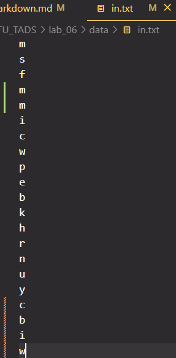
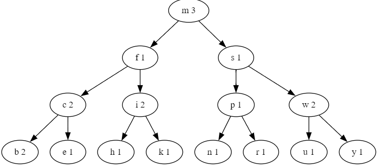

<!-- pandoc --pdf-engine=context -V mainfont="CMU Serif" -V monofont="CMU Typewriter Text"  -V geometry:a4paper -V documentclass=article -o report_Volnyga_Maxim_IU7-36.pdf markdown.md -->
### Описание условия

Построить дерево в соответствии со своим вариантом задания. Вывести
его на экран в виде дерева. Реализовать основные операции работы с
деревом: обход дерева, включение, исключение и поиск узлов. Сравнить
эффективность алгоритмов поиска в зависимости от высоты
деревьев и степени их ветвления

Построить частотный словарь (слово – количество повторений) из слов текстового
файла в виде дерева двоичного поиска. Вывести его на экран в виде дерева.
Осуществить поиск указанного слова в дереве и в файле. Если слова нет, то (по
желанию пользователя) добавить его в дерево и, соответственно, в файл. Сравнить
время поиска слова в дереве и в файле.

### Описание ТЗ

#### Описание исходных данных и результатов:

Программа получает на вход:

Целое число для выбора ввода меню [0, 12]

Строку для поиска/удаления/добавления в дерево/файл

Вывод результата в консоль: 

1. дерево прямой обход
2. дерево обратный обход 
3. дерево Фланговый  обход
4. Результат поиска слова по дереву
5. Результат поиска слова по файлу
6. Замеры времени  
7. Содержимое файла
8. Меню 
9. Информационное сообщение
10. Сообщение об ошибке (при ее возникновении)

Вывод результата в файл .gv для графического представления дерева
1. Результат удаления слова 
2. Результат результат добавления слова
2. Результат сравнения времени поиска слова в дереве

#### Описание задачи, реализуемой программой

Программа предоставляет работу с частотным словарем в виде дерева двоичного поиска, а именно: 

Меню:  
 
1)  -  Считать с файла и Вывести дерева двоичного поиска
2)  -  Поиск слово в дереве (добавление если слова нет)
3)  -  Поиск слово в файле (добавление если слова нет)
4)  -  Удаление слова в дереве
5)  -  Удаление слова в файле
6)  -  Сравнение времени поиска слова в дереве и в файле
7)  -  Вывести содержимое файла
8)  -  Вывести дерево прямой обход
9)  -  Вывести дерево обратный обход
10) -  Вывести дерево Фланговый  обход
11) -  Вывести ИНФО

#### Способ обращения к программе

Запускается через терминал командой ./app.exe [Путь к файлу].txt
Обращение к программе происходит путём консольного ввода.

#### Описание возможных аварийных ситуаций и ошибок пользователя

Аварийные ситуации:

1. Неверно введен пункт меню (не целое число или число меньшее 0 или больше 11)
2. Ввод пустой строки для поиска/удаления/добавления слова
3. В входном файле есть пустая строка
4. Поиск или удаление, если дерево не заполнено  


### Описание внутренних СД

### Структура дерева
```c

struct tree_node
{
    char *name;
    int count_repeat;

    struct tree_node *left; // min
    struct tree_node *right; //big
};
```

## Пример вывода бинарного дерева на экран
Исходный файл с данными:



Вывод бинарного дерева в консоль

Прямой обход по дереву: 

{m rep: 3} {f rep: 1} {c rep: 2} {b rep: 2} {e rep: 1} {i rep: 2} {h rep: 1} {k rep: 1} {s rep: 1} {p rep: 1} {n rep: 1} {r rep: 1} {w rep: 2} {u rep: 1} {y rep: 1} 

Обратный обход по дереву: 
{b rep: 2} {e rep: 1} {c rep: 2} {h rep: 1} {k rep: 1} {i rep: 2} {f rep: 1} {n rep: 1} {r rep: 1} {p rep: 1} {u rep: 1} {y rep: 1} {w rep: 2} {s rep: 1} {m rep: 3}

Фланговый обход по дереву: 
{b rep: 2} {c rep: 2} {e rep: 1} {f rep: 1} {h rep: 1} {i rep: 2} {k rep: 1} {m rep: 3} {n rep: 1} {p rep: 1} {r rep: 1} {s rep: 1} {u rep: 1} {w rep: 2} {y rep: 1} 

Вывод бинарного дерева в виде .png картинки (graphviz):




### Описание алгоритма

Основной алгоритм - добавление узла в дерево и удаление

удаления элемента делится на несколько случаев:

    1) у узла нет дочерних узлов;
    2) у узла есть левый дочерних узлов;
    3) у узла есть правый дочерних узлов;
    4) у узла есть оба ребёнка.

В 1 случае  просто удаляем узел

В случае 2 и 3 заменяем удаляемый узел на его потомка.
В случае 4  —  ставим на его место самого левого потомка из правого поддерева. те минимальный 

Добавление узла  в дерево разбивается на три этапа: 
1) включение узла в пустое дерево
2) поиск корня для добавления нового узла
3) включение узла в левое или правое поддерево (правое больше левого)

### Набор тестов с указанием проверяемого параметра
#### Позитивные тесты 

| Ввод                                                | Вывод                                                                                                                                                                                                                                               | Что                                                   |
| --------------------------------------------------- | --------------------------------------------------------------------------------------------------------------------------------------------------------------------------------------------------------------------------------------------------- | ----------------------------------------------------- |
| m s f i c w p e b k h r n u y                       | Прямой обход по дереву:  {m rep: 1} {f rep: 1} {c rep: 1} {b rep: 1} {e rep: 1} {i rep: 1} {h rep: 1} {k rep: 1} {s rep: 1} {p rep: 1} {n rep: 1} {r rep: 1} {w rep: 1} {u rep: 1} {y rep: 1}                                                       | Проверка считывания из файла и заполнение дерево      |
| m                                                   | Слово найдено {m rep: 1}                                                                                                                                                                                                                            | Проверка поиска слова в дереве                        |
| erfer                                               | Cлово удачно добавлено в дерево и файл Прямой обход по дереву:  {m rep: 1} {f rep: 1} {c rep: 1} {b rep: 1} {e rep: 1} {erfer rep: 1} {i rep: 1} {h rep: 1} {k rep: 1} {s rep: 1} {p rep: 1} {n rep: 1} {r rep: 1} {w rep: 1} {u rep: 1} {y rep: 1} | Проверка поиска слова в дереве не нахождение слова    |
| d                                                   | Cлово удачно добавлено в дерево и файл Прямой обход по дереву:  {d rep: 1}                                                                                                                                                                          | Проверка поиска по файлу                              |
| qweqe                                               | В бинарном дереве нет такого слова                                                                                                                                                                                                                  | Проверка удаления узла если такого слова нет          |
| m                                                   | Для начала заполните дерево                                                                                                                                                                                                                         | Проверка удаления узла при пустом дереве              |
| m                                                   | Данные успешно удалены Прямой обход по дереву:                                                                                                                                                                                                      | Проверка удаления узла, когда в дереве  только корень |
| m                                                   | Данные успешно удалены     Прямой обход по дереву:  {n rep: 1} {f rep: 1} {c rep: 1} {b rep: 1} {e rep: 1} {d rep: 1} {i rep: 1} {h rep: 1} {k rep: 1} {s rep: 1} {p rep: 1} {r rep: 1} {w rep: 1} {u rep: 1} {y rep: 1}                            | Проверка удаления корня                               |
| d                                                   | Данные успешно удалены Прямой обход по дереву:  {m rep: 2} {f rep: 1} {c rep: 1} {e rep: 1} {d rep: 1} {i rep: 1} {h rep: 1} {k rep: 1} {s rep: 1} {p rep: 1} {n rep: 1} {r rep: 1} {w rep: 1} {u rep: 1} {y rep: 1}                                | Проверка удаления листа                               |
| i                                                   | Данные успешно удалены Прямой обход по дереву:  {m rep: 2} {f rep: 1} {c rep: 1} {b rep: 1} {e rep: 1} {d rep: 1} {k rep: 1} {h rep: 1} {s rep: 1} {p rep: 1} {n rep: 1} {r rep: 1} {w rep: 1} {u rep: 1} {y rep: 1}                                | Проверка удаления узла, узла который имеет 2 потомка  |
| k                                                   | Данные успешно удалены Прямой обход по дереву:  {m rep: 2} {f rep: 1} {c rep: 1} {b rep: 1} {e rep: 1} {d rep: 1} {h rep: 1} {s rep: 1} {p rep: 1} {n rep: 1} {r rep: 1} {w rep: 1} {u rep: 1} {y rep: 1}                                           | Проверка удаления узла, который имеет 1 потомка       |
| ywed    файл состоит: m s f i c w p e b k h r n u y | Слово не найдено в файле                                                                                                                                                                                                                            | Проверка удаления в файле слово, которого нет         |
| y                                                   | Введите слово: y Слово успешно удаленно                                                                                                                                                                                                             | Проверка удаления в файле последнего слово            |
| m                                                   | Введите слово: y Слово успешно удаленно                                                                                                                                                                                                             | Проверка удаления в файле первого слово               |
| c                                                   | Введите слово: y Слово успешно удаленно                                                                                                                                                                                                             | Проверка удаления в файле  слово                      |

#### Негативные тесты

| Ввод                   | Вывод                                          | Что                                                         |
| ---------------------- | ---------------------------------------------- | ----------------------------------------------------------- |
| ./app.exe              | ОШИБКА не удалось отрыть файл. код ошибки =  1 | Проверка входного файла                                     |
| ./app.exe не сущ. файл | ОШИБКА не удалось отрыть файл. код ошибки =  1 | Проверка входного файла                                     |
| ./app.exe data/in.txt  | Файл содержит недопустимые поля                | Проверка входного файла, в файле присутствует пустая строка |
| ./app.exe data/in.txt  | Файл пуст сначала заполните его                | Проверка входного файла, файл пуст                          |
| пустая строка          | ОШИБКА Вы ввели пустую строку, код ошибки =  7 | Проверка ввода пустой строки для поиска по дереву           |
| пустая строка          | ОШИБКА Вы ввели пустую строку, код ошибки =  7 | Проверка ввода пустой строки для поиска по файлу            |


### Оценка эффективности

Tree nodes amount - общее количество узлов в дереве, tree depth - высота дерева
|Tree nodes amount             |Tree depth                    |Search in balanced (ms)       |Search in file (ms)           |
|-----------------------------------------------------------------------------------------------------------------|-|---|--|
|5                             |3                             |0.000220                      |0.004220                      |
|10                            |4                             |0.000260                      |0.004530                      |
|20                            |5                             |0.000280                      |0.004610                      |
|40                            |6                             |0.000320                      |0.010190                      |
|65                            |7                             |0.000300                      |0.011130                      |
|80                            |7                             |0.000340                      |0.011910                      |
|130                           |8                             |0.000350                      |0.014070                      |
|160                           |8                             |0.000330                      |0.015410                      |
|260                           |9                             |0.000310                      |0.020050                      |
|320                           |9                             |0.000400                      |0.022850                      |
|520                           |10                            |0.000330                      |0.032200                      |
|640                           |10                            |0.000300                      |0.036730                      |
|1025                          |11                            |0.000380                      |0.059450                      |
|1040                          |11                            |0.000290                      |0.060990                      |
|1280                          |11                            |0.000310                      |0.068950                      |
|2050                          |12                            |0.000360                      |0.110120                      |
|2080                          |12                            |0.000380                      |0.112560                      |
|2560                          |12                            |0.000390                      |0.133640                      |
|4100                          |13                            |0.000330                      |0.217770                      |
|4160                          |13                            |0.000390                      |0.221340                      |
|5120                          |13                            |0.000300                      |0.263500                      |
|8200                          |14                            |0.000320                      |0.420860                      |
|8320                          |14                            |0.000270                      |0.425360                      |

Left-side и Right-side - деревья у которых узлы расположены по левую или правую сторону соответственно
|Tree nodes amount           |Search in left-side tree (ms)|Search in file              |Search in right-side tree (ms)|Search in file              |
|----|-----|-----------------------------------------------|---|------------------------------------------------------------|
|10                          |0.000390                    |0.008590                    |0.000350                    |0.008770                    |
|20                          |0.000390                    |0.009160                    |0.000440                    |0.009350                    |
|30                          |0.000440                    |0.009770                    |0.000440                    |0.009590                    |
|40                          |0.000550                    |0.010010                    |0.000490                    |0.010190                    |
|50                          |0.000610                    |0.010590                    |0.000620                    |0.010550                    |
|60                          |0.000520                    |0.011190                    |0.000600                    |0.011070                    |
|70                          |0.000580                    |0.011600                    |0.000640                    |0.011490                    |
|80                          |0.000640                    |0.011770                    |0.000660                    |0.011760                    |
|90                          |0.000760                    |0.012550                    |0.000740                    |0.012820                    |
|100                         |0.000690                    |0.013110                    |0.000780                    |0.013170                    |
|110                         |0.000870                    |0.013380                    |0.000900                    |0.013480                    |
|140                         |0.000940                    |0.014800                    |0.001140                    |0.014700                    |
|150                         |0.001040                    |0.014950                    |0.001120                    |0.015420                    |
|160                         |0.001080                    |0.015550                    |0.001130                    |0.015720                    |
|170                         |0.001200                    |0.016280                    |0.001180                    |0.016170                    |
|180                         |0.001310                    |0.016380                    |0.001350                    |0.016650                    |
|190                         |0.001320                    |0.017000                    |0.001420                    |0.017060                    |
|200                         |0.001480                    |0.017480                    |0.001390                    |0.017180                    |
|210                         |0.001440                    |0.018070                    |0.001620                    |0.017750                    |
|220                         |0.001520                    |0.018240                    |0.001490                    |0.018520                    |
|230                         |0.001510                    |0.018610                    |0.001590                    |0.018740                    |
|240                         |0.001640                    |0.019320                    |0.001640                    |0.019050                    |
|250                         |0.001680                    |0.019670                    |0.001660                    |0.019430                    |
|260                         |0.001630                    |0.020400                    |0.001700                    |0.019970                    |
|270                         |0.001710                    |0.020410                    |0.001620                    |0.020870                    |
|280                         |0.001700                    |0.020810                    |0.001820                    |0.021900                    |
|290                         |0.001840                    |0.021730                    |0.001860                    |0.021780                    |
|300                         |0.001850                    |0.022040                    |0.001890                    |0.022110                    |
|310                         |0.001950                    |0.022290                    |0.002060                    |0.022480                    |
|320                         |0.002060                    |0.022860                    |0.002260                    |0.023160                    |
|330                         |0.002260                    |0.023250                    |0.002330                    |0.023180                    |
|340                         |0.002310                    |0.023850                    |0.002170                    |0.023780                    |
|350                         |0.002220                    |0.024380                    |0.002250                    |0.025010                    |
|360                         |0.002300                    |0.024540                    |0.002310                    |0.023970                    |
|370                         |0.002280                    |0.025170                    |0.002390                    |0.025150                    |
|410                         |0.002560                    |0.026980                    |0.002630                    |0.027410                    |
|420                         |0.002770                    |0.028190                    |0.002720                    |0.027460                    |
|430                         |0.002950                    |0.027620                    |0.002690                    |0.027480                    |
|440                         |0.002710                    |0.028200                    |0.002600                    |0.028440                    |
|450                         |0.002760                    |0.029550                    |0.002660                    |0.028880                    |
|460                         |0.002790                    |0.029260                    |0.002740                    |0.028860                    |
|470                         |0.002800                    |0.029810                    |0.002890                    |0.029840                    |
|480                         |0.002850                    |0.030300                    |0.002930                    |0.030280                    |
|490                         |0.003040                    |0.030610                    |0.003170                    |0.030330                    |
|500                         |0.003550                    |0.030860                    |0.003220                    |0.030820                    |
|510                         |0.003340                    |0.031680                    |0.003420                    |0.031310                    |
|520                         |0.003200                    |0.032030                    |0.003430                    |0.031870                    |
|530                         |0.003390                    |0.032930                    |0.003120                    |0.032720                    |
|540                         |0.003400                    |0.032700                    |0.003240                    |0.033220                    |
|550                         |0.003370                    |0.033330                    |0.003350                    |0.033100                    |
|560                         |0.003560                    |0.032800                    |0.003680                    |0.033050                    |
|570                         |0.003850                    |0.034460                    |0.003540                    |0.034030                    |
|580                         |0.003550                    |0.035350                    |0.003380                    |0.035040                    |
|590                         |0.003630                    |0.035210                    |0.003680                    |0.035040                    |
|600                         |0.003650                    |0.035590                    |0.003580                    |0.035460                    |
|610                         |0.003580                    |0.036060                    |0.003620                    |0.036010                    |
|620                         |0.004050                    |0.036340                    |0.004170                    |0.036660                    |
|630                         |0.004230                    |0.036880                    |0.004010                    |0.036780                    |
|640                         |0.003740                    |0.037230                    |0.004060                    |0.036910                    |
|650                         |0.003800                    |0.037780                    |0.004130                    |0.037500                    |
|660                         |0.004090                    |0.038560                    |0.003850                    |0.038530                    |
|670                         |0.004030                    |0.039180                    |0.004120                    |0.039010                    |
|680                         |0.004420                    |0.038820                    |0.004230                    |0.038500                    |
|690                         |0.004260                    |0.043010                    |0.003980                    |0.043160                    |
|700                         |0.004210                    |0.045660                    |0.004240                    |0.044400                    |
|710                         |0.004190                    |0.044090                    |0.004250                    |0.044080                    |
|720                         |0.004290                    |0.044250                    |0.004660                    |0.044560                    |
|730                         |0.004670                    |0.045780                    |0.004530                    |0.045780                    |
|740                         |0.004600                    |0.046310                    |0.004300                    |0.046520                    |
|750                         |0.004450                    |0.045940                    |0.004440                    |0.046020                    |
|760                         |0.004380                    |0.046410                    |0.004650                    |0.046230                    |
|770                         |0.004650                    |0.048530                    |0.005000                    |0.047830                    |
|780                         |0.005100                    |0.047600                    |0.005260                    |0.047070                    |
|790                         |0.004940                    |0.047910                    |0.004760                    |0.048200                    |
|800                         |0.004710                    |0.049030                    |0.004650                    |0.049750                    |
|810                         |0.005600                    |0.048540                    |0.005160                    |0.048090                    |
|820                         |0.005160                    |0.048850                    |0.005000                    |0.049020                    |
|830                         |0.005250                    |0.050360                    |0.004820                    |0.050780                    |
|840                         |0.005160                    |0.049970                    |0.005020                    |0.049490                    |
|850                         |0.005040                    |0.050500                    |0.005210                    |0.050480                    |
|860                         |0.005080                    |0.052170                    |0.005370                    |0.052110                    |
|870                         |0.005500                    |0.051990                    |0.005380                    |0.051330                    |
|880                         |0.005240                    |0.051540                    |0.005300                    |0.051720                    |
|890                         |0.005410                    |0.053950                    |0.005910                    |0.053570                    |
|900                         |0.005530                    |0.054200                    |0.005770                    |0.053630                    |
|910                         |0.005760                    |0.053370                    |0.005390                    |0.053500                    |
|920                         |0.005420                    |0.053820                    |0.005500                    |0.054300                    |
|930                         |0.005730                    |0.055590                    |0.005510                    |0.055120                    |
|940                         |0.005810                    |0.054240                    |0.005990                    |0.054310                    |
|950                         |0.006100                    |0.054750                    |0.005740                    |0.054550                    |
|960                         |0.005910                    |0.056490                    |0.005590                    |0.055920                    |
|970                         |0.005700                    |0.055720                    |0.006230                    |0.055210                    |
|980                         |0.006260                    |0.056500                    |0.005820                    |0.056250                    |
|990                         |0.006090                    |0.058110                    |0.006040                    |0.057130                    |
|1000                        |0.006180                    |0.057180                    |0.006250                    |0.056940                    |

### Выводы по проделанной работе

В лучшем случае сложность поиска в дереве может оказаться O(log2(N)) (в случае, если дерево
идеально сбалансированно), а в худшем O(N) 

Мы можем заметить, что время поиска слов из файла растет линейно с
увеличением количества элементов, это согласуется с теорией. 
Также мы видим, что поиск в хорошо сбалансированном дереве
быстрее поиска в дереве, вырожденном в списке, особенно при больших
размерностях, что также согласуется с теорией.

Но файл с различными словами занимает меньше памяти, так как в нем хранится только  слова, в отличие от дерева где еще хранятся указатели (left/right) и количество повторений слова. Конечно если повторений будет много, то дерево займет меньше места.

Стоит заметить что все тесты проведены для не повторяющихся слов, если будут значительные повторы слов, то скорость поиска по дереву будет еще больше

### Ответы на вопросы

1. Что такое дерево?
   
Дерево — структура данных (рекурсивная), используемая для представления
иерархических связей

2. Как выделяется память под представление деревьев?
Память выделяется как для связанного списка, то есть под каждый узел
отдельно.

3. Какие бывают типы деревьев?

N-арное дерево, сбалансированное дерево, бинарное дерево, бинарное дерево
поиска, дерево AVL, красно-чёрное дерево

4. Какие стандартные операции возможны над деревьями?
   
Поиск по дереву, обход дерева, добавление элемента в дерево, удаление
элемента из дерева

6. Что такое дерево двоичного поиска?
   
Двоичное дерево поиска (ДДП) — двоичное дерево
В нем для каждого узла выполняется условие, что правый потомок больше
или равен родителю, а левый потомок строго меньше родителя (или
наоборот)