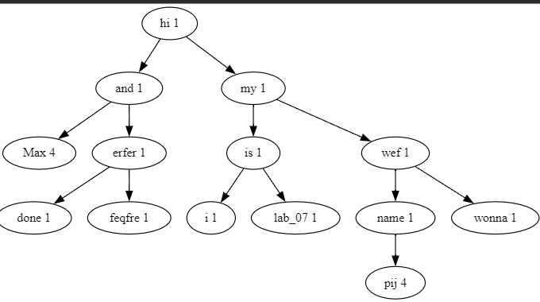

### Описание условия

Получить навыки работы со сбалансированными деревьями и хеш-таблицами, сравнить эффективность поиска в двоичных деревьях поиска, сбалансированных деревьях поиска и хеш-таблицах

### Описание ТЗ

Построить хеш-таблицу для слов текстового файла. Осуществить поиск
указанного слова в двоичном дереве поиска (ДДП) и в хеш-таблице, если его
нет, то добавить его (по желанию пользователя) в дерево и, соответственно,
в таблицу. При необходимости использовать реструктуризацию таблицы.
Сбалансировать дерево. Сравнить время поиска, объем памяти и количество
сравнений при использовании ДДП, сбалансированных деревьев и хеш-
таблиц

#### Описание исходных данных и результатов:

Программа получает на вход:

Целое число для выбора ввода меню [0, 8]

Строку для поиска/добавления в дерево/файл/таблицу

Вывод результата в консоль: 

1. дерево прямой обход
2. Результат поиска слова по дереву
3. Результат поиска слова по хэш-таблице
4. Замеры времени
5. Содержимое файла
6. Меню 
7. Сообщение об ошибке (при ее возникновении)

Вывод результата в файл .gv для графического представления дерева

#### Описание задачи, реализуемой программой

Программа позволяет произвести поиск / добавление введённой строки в дереве/ хэш-таблице, а также визуализировать используемое для работы дерево или хеш-таблицу.

Меню:  

1)  -  Ввести данные из файла (заполнение ДДП и хеш-таблицы)
2)  -  Поиск слово в дереве (добавление если слова нет)
3)  -  Поиск слово в  хеш-таблице (добавление если слова нет)
4)  -  Сбалансировать дерево
5)  -  Эффективность поиска (ДДП / АВЛ / хеш-таблица) 
6)  -  Вывести файл
7)  -  Вывести дерево
8) -   Вывести хеш-таблицу

0)  -  Выход из программы


#### Способ обращения к программе

Запускается через терминал командой ./app.exe [Путь к файлу].txt
Обращение к программе происходит путём консольного ввода.

#### Описание возможных аварийных ситуаций и ошибок пользователя

Аварийные ситуации:

1. Неверно введен пункт меню (не целое число или число меньшее 0 или больше 8)
2. Ввод пустой строки для поиска/удаления/добавления слова
3. В входном файле есть пустая строка
4. Поиск если дерево или хэш-таблица не заполнено  

### Описание внутренних СД

### Структура дерева
```c
struct tree_node
{
    char *name;
    int count_repeat;
    int height;

    struct tree_node *left; //min
    struct tree_node *right; //big
};
```

### Структура для хранения хеш-таблицы
```c
#define  WORD_SIZE 20

typedef struct hash_table_t
{
    int count; // — размер хеш-таблицы
    hash_t **array; //массив указателей на список — структуру данных,
} hash_table_t;
};

typedef struct hash_t
{
    char word[WORD_SIZE]; //значение текущего элемента списка
    struct hash_t *next; //указатель на следующий элемент списка
} hash_t

```

## Пример вывода бинарного дерева на экран
Исходный файл с данными:


Вывод бинарного дерева в консоль

Прямой обход по дереву: 

{hi rep: 1} {Max rep: 4} {and rep: 1} {done rep: 1} {erfer rep: 1} {feqfre rep: 1} {my rep: 1} {is rep: 1} {i rep: 1} {lab_07 rep: 1} {name rep: 1} {wonna rep: 1} {wef rep: 1} {pij rep: 4} 

Вывод бинарного дерева в виде .png картинки (graphviz):


после балансировки:



## Пример вывода хэш-таблицы на экран


### Описание алгоритма

#### Дерево двоичного поиска

Добавление узла  в дерево разбивается на три этапа: 
1) включение узла в пустое дерево
2) поиск корня для добавления нового узла
3) включение узла в левое или правое поддерево (правое больше левого)

#### Хеш-таблица
Для каждого элемента таблицы: определяется хеш-значение, по хеш-
значению элемент добавляется в односвязный список (метод цепочек
устранения коллизий ).
ключом является остаток от деления суммы кодов символов строки на размер
таблицы.

При поиске в хеш-таблице считается число сравнений для элемента. Если оно
превышает введенное пользователем, происходит реструктуризация хеш-
таблицы.

Реструктуризация хеш-таблицы: размер таблицы увеличивается в 2 раза и для
нового размера таблицы все слова получают новые хеш-значения и запоняют
таблицу

### Набор тестов с указанием проверяемого параметра
#### Позитивные тесты 

#### Проверка ввода из файла


count_cmp =  допустимое число сравнений в хеш-таблице

| Ввод | Вывод| Что|
| - | - | - |
|  [пункт 2] Max| Введите слово: Max Слово найдено {Max rep: 4} | Проверка поиска слова в дереве                        |
| [пункт 2] erfer| Cлово удачно добавлено в дерево, таблицу и файл  | Проверка поиска слова в дереве не нахождение слова    |
| [пункт 3] Max count_cmp = 2 | Cлово успешно найдено! { Max } кол-во сравнений = 1 | Проверка поиска по хэш-таблице|
| [пункт 3] Max count_cmp = 1 | Cлово успешно найдено! { Max } кол-во сравнений = 1 | Проверка поиска по хэш-таблице|
| [пункт 3] wedewd count_cmp = 2 | Cлово удачно добавлено в дерево, таблицу и файл | Проверка добавления в хэш-таблицу|


#### Проверка реструктуризации

До реструктуризации:


После реструктуризации:


#### Проверка балансировки

До балансировки:


После балансировки:


#### Негативные тесты

| Ввод                   | Вывод                                          | Что                                                         |
| ---------------------- | ---------------------------------------------- | ----------------------------------------------------------- |
| ./app.exe              | ОШИБКА не удалось отрыть файл. код ошибки =  1 | Проверка входного файла                                     |
| ./app.exe не сущ. файл | ОШИБКА не удалось отрыть файл. код ошибки =  1 | Проверка входного файла                                     |
| ./app.exe data/in.txt  | Файл содержит недопустимые поля                | Проверка входного файла, в файле присутствует пустая строка |
| ./app.exe data/in.txt  | Файл пуст сначала заполните его                | Проверка входного файла, файл пуст                          |
| пустая строка          | ОШИБКА Вы ввели пустую строку, код ошибки =  7 | Проверка ввода пустой строки для поиска           |
| [Пункт 2]          | Сначала заполните данные из файла пункт меню ( 1 ) | Проверка поиска по дереву, если дерево не заполнено |
| [Пункт 3]          | Сначала заполните данные из файла пункт меню ( 1 ) | Проверка поиска по хэш-таблице, если таблица не заполнено |


### Оценка эффективности

Tree nodes amount (TNA) - общее количество узлов в дереве, tree depth (TD) - высота дерева, 

Поиск в сбалансированном дереве (ms) = balanced, Поиск в не сбалансированном дереве (ms) = DDP, Search in hash table (ms) = hash

Первое значение в столбцах (balanced, DDP, HASH) время поиска в мс, второе значение в {} кол-во сравнений, третие значение в  {} означает кол-во памяти в байтах

|TNA    |TD     |balanced                           |DDP                                |HASH                               |
|-   |-     |-        |-|-|
|3000   |12     |0.000650        {10  } {96000     }|0.001270        {78  } {96000     }|0.000520        {1   } {84000     }|
|6000   |13     |0.000670        {11  } {192000    }|0.005110        {382 } {192000    }|0.000470        {1   } {168000    }|
|9000   |14     |0.000850        {12  } {288000    }|0.001400        {71  } {288000    }|0.000460        {1   } {252000    }|
|11000  |14     |0.000740        {12  } {352000    }|0.003520        {254 } {352000    }|0.000610        {1   } {308000    }|
|14000  |14     |0.000790        {12  } {448000    }|0.002190        {137 } {448000    }|0.000440        {1   } {392000    }|
|17000  |15     |0.000740        {13  } {544000    }|0.001670        {101 } {544000    }|0.000490        {1   } {476000    }|
|18000  |15     |0.000830        {13  } {576000    }|0.003300        {227 } {576000    }|0.000430        {1   } {504000    }|
|20000  |15     |0.001010        {13  } {640000    }|0.005560        {392 } {640000    }|0.000590        {1   } {560000    }|
|21000  |15     |0.000770        {13  } {672000    }|0.003610        {248 } {672000    }|0.000510        {1   } {588000    }|
|30000  |15     |0.001020        {13  } {960000    }|0.002800        {165 } {960000    }|0.000470        {1   } {840000    }|
|32000  |15     |0.000870        {13  } {1024000   }|0.003070        {185 } {1024000   }|0.000530        {1   } {896000    }|
|34000  |16     |0.000940        {14  } {1088000   }|0.004360        {412 } {1088000   }|0.000330        {1   } {952000    }|
|35000  |16     |0.000730        {14  } {1120000   }|0.001930        {193 } {1120000   }|0.000280        {1   } {980000    }|
|36000  |16     |0.000640        {14  } {1152000   }|0.003150        {371 } {1152000   }|0.000290        {1   } {1008000   }|
|37000  |16     |0.000880        {14  } {1184000   }|0.003040        {349 } {1184000   }|0.000270        {1   } {1036000   }|
|38000  |16     |0.000650        {14  } {1216000   }|0.001640        {158 } {1216000   }|0.000330        {1   } {1064000   }|
|40000  |16     |0.000770        {14  } {1280000   }|0.002990        {324 } {1280000   }|0.000280        {1   } {1120000   }|
|42000  |16     |0.000770        {14  } {1344000   }|0.001990        {198 } {1344000   }|0.000250        {1   } {1176000   }|
|43000  |16     |0.000740        {14  } {1376000   }|0.001500        {125 } {1376000   }|0.000290        {1   } {1204000   }|
|44000  |16     |0.000710        {14  } {1408000   }|0.004020        {461 } {1408000   }|0.000230        {1   } {1232000   }|
|46000  |16     |0.000720        {14  } {1472000   }|0.003520        {414 } {1472000   }|0.000300        {1   } {1288000   }|
|47000  |16     |0.000690        {14  } {1504000   }|0.008400        {962 } {1504000   }|0.000270        {1   } {1316000   }|
|48000  |16     |0.000770        {14  } {1536000   }|0.006150        {708 } {1536000   }|0.000320        {1   } {1344000   }|
|55000  |16     |0.000760        {14  } {1760000   }|0.002650        {277 } {1760000   }|0.000310        {1   } {1540000   }|
|57000  |16     |0.000670        {14  } {1824000   }|0.005830        {692 } {1824000   }|0.000280        {1   } {1596000   }|
|58000  |16     |0.000730        {14  } {1856000   }|0.004040        {449 } {1856000   }|0.000290        {1   } {1624000   }|
|61000  |16     |0.000640        {14  } {1952000   }|0.007430        {858 } {1952000   }|0.000370        {1   } {1708000   }|
|62000  |16     |0.000690        {14  } {1984000   }|0.002090        {185 } {1984000   }|0.000310        {1   } {1736000   }|
|66000  |17     |0.000710        {15  } {2112000   }|0.002480        {235 } {2112000   }|0.000320        {1   } {1848000   }|
|67000  |17     |0.000950        {15  } {2144000   }|0.003280        {317 } {2144000   }|0.000330        {1   } {1876000   }|
|69000  |17     |0.000980        {15  } {2208000   }|0.002880        {274 } {2208000   }|0.000310        {1   } {1932000   }|
|70000  |17     |0.000820        {15  } {2240000   }|0.001990        {173 } {2240000   }|0.000320        {1   } {1960000   }|
|71000  |17     |0.001200        {15  } {2272000   }|0.005450        {601 } {2272000   }|0.000250        {1   } {1988000   }|
|72000  |17     |0.000870        {15  } {2304000   }|0.002010        {177 } {2304000   }|0.000360        {1   } {2016000   }|
|73000  |17     |0.000820        {15  } {2336000   }|0.016110        {1779} {2336000   }|0.000320        {1   } {2044000   }|
|74000  |17     |0.000920        {15  } {2368000   }|0.004720        {524 } {2368000   }|0.000280        {1   } {2072000   }|
|75000  |17     |0.000800        {15  } {2400000   }|0.005160        {570 } {2400000   }|0.000280        {1   } {2100000   }|
|76000  |17     |0.000800        {15  } {2432000   }|0.009330        {1032} {2432000   }|0.000350        {1   } {2128000   }|
|77000  |17     |0.001110        {15  } {2464000   }|0.004790        {498 } {2464000   }|0.000370        {1   } {2156000   }|
|78000  |17     |0.000880        {15  } {2496000   }|0.005320        {546 } {2496000   }|0.000210        {1   } {2184000   }|
|80000  |17     |0.000910        {15  } {2560000   }|0.002320        {200 } {2560000   }|0.000230        {1   } {2240000   }|
|81000  |17     |0.000780        {15  } {2592000   }|0.002410        {203 } {2592000   }|0.000300        {1   } {2268000   }|
|83000  |17     |0.000990        {15  } {2656000   }|0.004260        {432 } {2656000   }|0.000340        {1   } {2324000   }|
|84000  |17     |0.000940        {15  } {2688000   }|0.006970        {726 } {2688000   }|0.000310        {1   } {2352000   }|
|85000  |17     |0.000840        {15  } {2720000   }|0.004090        {420 } {2720000   }|0.000220        {1   } {2380000   }|
|86000  |17     |0.000890        {15  } {2752000   }|0.003530        {362 } {2752000   }|0.000350        {1   } {2408000   }|
|88000  |17     |0.001010        {15  } {2816000   }|0.006170        {676 } {2816000   }|0.000340        {1   } {2464000   }|
|93000  |17     |0.000950        {15  } {2976000   }|0.011670        {1225} {2976000   }|0.000320        {1   } {2604000   }|
|94000  |17     |0.000890        {15  } {3008000   }|0.003450        {355 } {3008000   }|0.000350        {1   } {2632000   }|
|96000  |17     |0.000930        {15  } {3072000   }|0.005700        {613 } {3072000   }|0.000340        {1   } {2688000   }|
|97000  |17     |0.000900        {15  } {3104000   }|0.003750        {362 } {3104000   }|0.000340        {1   } {2716000   }|
|98000  |17     |0.000950        {15  } {3136000   }|0.006630        {709 } {3136000   }|0.000270        {1   } {2744000   }|


### Выводы по проделанной работе

Сбалансированное двоичное дерево в среднем случае превосходит по эффективности обычное двоичное дерево поиска по операции поиска элементов. Однако стоит учитывать повышение затрат на поддержание балансировки.

хеш-таблица позволяет реализовать ещё более эффективный поиск. Накладные расходы на расчёт хеш-функции практически незаметны, так как ключами являются слова, хеш-функция которых тривиальна. Подводя итоги, можно сделать вывод, что для реализации описанной задачи наиболее эффективной структурой данных является хеш-таблица.

Эффективность по памяти:

В моей реализации для одного узла дерева необходимы 2 поля типа инт(высота и количество повторений слова), два указателя (лево, право) и непосредственно указатель на слово, для одного такого узла требуется 32 байта + область памяти.

В моей реализации для одной записи хэш-таблицы необходим массив символов из 20 эл, указатель на следующий элемент. Таким образом под одну запись необходимо 28 байт

Итог хеш-таблица более эффективна, чем деревья поиска.

### Ответы на вопросы

1. Чем отличается идеально сбалансированное дерево от АВЛ-дерева?

У идеально сбалансированного дерева число вершин в левом и правом
поддеревьях отличается не более, чем на единицу. У каждого узла АВЛ-
дерева высота двух поддеревьев отличается не более, чем на единицу.

2. Чем отличается поиск в АВЛ-дереве от поиска в дереве двоичного поиска?

Поиск в АВЛ-дереве происходит быстрее, чем поиск в дереве двоичного
поиска и с меньшим числом сравнений .

3. Что такое хеш-таблица, каков принцип ее построения?

Хеш-таблица - массив, заполненный в порядке, определенным хеш-
функцией .

Принцип построения: хеш-функция ставит в соответствие каждому ключу ki
индекс ячей ки j, где расположен элемент с этим ключом. Таким образом:
h (ki) = j, если j=(1, m), где j принадлежит множеству от 1 до m, а m. –
размерность массива.

4. Что такое коллизии? Каковы методы их устранения?

Коллизии - ситуации, когда разным ключам соответствует одно значение
хеш- функции, то есть, когда h(K1)=h(K2), в то время как K1 ≠ K2.

Методы устранения:

1) Внешнее (открытое) хеширование (метод цепочек). В случае, когда
элемент таблицы с индексом, который вернула хеш-функция, уже занят, к
нему присоединяется связный список. Таким образом, если для нескольких
различных значений ключа возвращается одинаковое значение хеш-функции,то по этому адресу находится указатель на связанный список, который содержит все значения.

2) Внутреннее (закрытое) хеширование (открытая адресация). В этом случае,
если ячей ка с вычисленным индексом занята, то можно просто
просматривать следующие записи таблицы по порядку до тех пор, пока не
будет най ден ключ K или пустая позиция в таблице.

5. В каком случае поиск в хеш-таблицах становится неэффективен?

Если для поиска элемента необходимо более 3–4 сравнений , то
эффективность использования хеш-таблицы пропадает.

6. Эффективность поиска в АВЛ деревьях, в дереве двоичного поиска и в хеш-
таблицах.

АВЛ-деревья : O(log2(n)) ДДП : O(log2(n)) - O(n) Хеш-таблица: O(1)