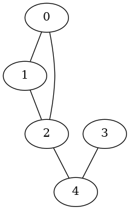
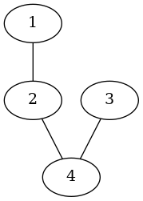
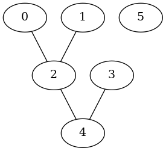
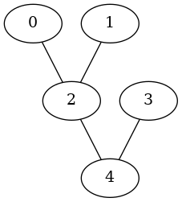
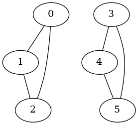
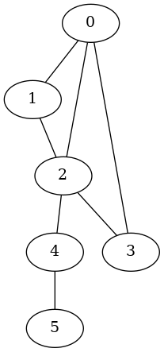
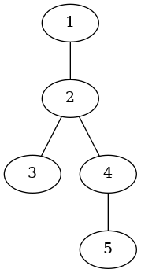
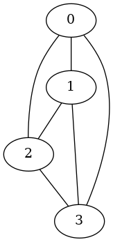

### Описание ТЗ

Обработать графовую структуру в соответствии с заданным 
вариантом. Обосновать выбор необходимого алгоритма и выбор 
структуры для представления графов. Ввод данных осуществить на 
усмотрение программиста. Результат выдать в графической форме. 
Задан граф - не дерево. Проверить, можно ли превратить его в 
дерево удалением одной вершины вместе с ее ребрами.

#### Описание исходных данных и результатов:

Входные данные:

При запуске программы имя входного файла 

Входной файл - текстовый содержит количество 
вершин и пары чисел (а б) это означает, что (а б) вершины связаны

Выходные данные: 

Информационные сообщения (ошибки, возможность перестройки графа)

Эффективность работы структур данных: Время работы  функции, занимаемая память структуры  графа

Вывод результата в файл .dot для графического представления графов  и фото .png этих графов 

#### Описание задачи, реализуемой программой

Программа позволяет проверить возможность перестройки неориентированного графа (далее граф) в граф дерево, удалением одной вершины и если такая возможность есть, удаляет вершину. 

#### Способ обращения к программе

Запускается через терминал командой ./app.exe [Путь к файлу].txt

#### Описание возможных аварийных ситуаций и ошибок пользователя

Аварийные ситуации:

1. Неверное название файла или пустой файл

2. Некорректное содержание файла


### Описание внутренних СД

### Структура узла для списка смежностей: 

```c
typedef struct vertex
{
    int value; // Значение вершины
    struct vertex *next; //Указатель на следующий узел
} vertex_t;
```

### Структура для графа

```c
typedef struct graph
{
    int count_v; //Количество вершин графа 
    int count_e; // Количество рёбер графа
    vertex_t *array; //Указатель на массив со входами в списки смежностей
} graph_t;
```

## Пример вывода графа 

Исходный файл с данными:

```
5
0 1
1 2
3 4
2 4
2 0
```
графическое представление исходного графа:



графическое представление нового графа дерева:




### Описание алгоритма

Основной алгоритм - поиск такой вершины графа при удалении котрой, получим дерево

Для этого необходимы свойства дерева:

a. Связанный граф 

b. Количество рёбер = Количество вершин – 1 то есть ациклический граф

Следовательно если у нас граф, а не дерево необходимо найти такую вершину при удалении которой, граф будет удовлетворять свойствам дерева

Алгоритм можно разбить на два пункта: 

1. Обход массива со списком смежностей и поиск вершины удовлетворяющей свойству дерева (б)
2. Если такая вершина найдена удалить и проверить на связанность графа

Так как нам необходимо проверить связанность графа то есть обойти все вершины был выбран алгоритм обхода в глубину.
 
Отличие поиска в глубину от поиска в ширину заключается в том, что (в случае неор графа) результатом алгоритма поиска в глубину является некоторый маршрут, следуя которому можно обойти последовательно все вершины графа, доступные из начальной вершины. Этим он принципиально отличается от поиска в ширину, где одновременно обрабатывается множество вершин, в поиске в глубину в каждый момент исполнения алгоритма обрабатывается только одна вершина. Поиск в глубину не находит кратчайшее пути, зато оптимально подходит для данной задачи.

### Набор тестов с указанием проверяемого параметра

v = кол-во вершин, задается первым значением в файле

### Негативные тесты

| Ввод | Вывод| Что|
| - | - | - |
| ./app.exe d | Ошибка: открытие файла не возможно | Проверка ввода не существующего файла                        |
|  ./app.exe data/graph_neg.txt | Ошибка: файл пуст  | Проверка Пустой файл    |
| v = 0 1 2 | Ошибка: некорректные данные в файле | Проверка нулевого значения кол-ва вершин|
| v = -1 1 2 | Ошибка: некорректные данные в файле | Проверка отрицательного значения кол-ва вершин |
| v = wefewf 1 2 | Ошибка: некорректные данные в файле | Проверка строки для значения кол-ва вершин |
| v = 1 0 1 1 0  | Ошибка: некорректные данные в файле | Кол-во вершин больше чем на самом деле |
| v = 2 0 1 1 wedfwe  | Ошибка: некорректные данные в файле | Проверка строки для значения вершины  |


### Позитивные тесты 

#### Проверяется не связанный граф, одна вершина не связана 

Ввод: 

```
6
1 2
3 4
2 4
0 2
```

Вывод: 

```
Построение исходного графа, графическое построение сохранено в graphs/graph.png

Для преобразования графа в дерево,
необходимо удалить {5} узел

Посторение нового графа дерева, графическое построение сохранено в graphs/new_graph.png

На нахождение нужного узла было затрачено 10590 тиков
Граф, на основе списка смежности занимает 224 байт

```
Исходный граф:



После удаления вершины:



#### Проверка, если граф уже дерево 

Ввод: 

```
5
1 2
3 4
2 4
0 2

```

Вывод: 

```
Построение исходного графа, графическое построение сохранено в graphs/graph.png
Граф уже является деревом

Граф, на основе списка смежности занимает 208 байт

```
Исходный граф:


#### Проверка, несвязанного графа   

Ввод: 

```
6
0 1
1 2
2 0
3 4
4 5
5 3

```

Вывод: 

```
Построение исходного графа, графическое построение сохранено в graphs/graph.png
Перестройка из графа в дерево невозможно

Граф, на основе списка смежности занимает 288 байт

```
Исходный граф:



#### Обычный  тест с двумя циклами связанного с одной вершиной 

Ввод: 

```
6
0 1
0 2
0 3
1 2
2 3
2 4
4 5

```

Вывод: 

```
Построение исходного графа, графическое построение сохранено в graphs/graph.png

Для преобразования графа в дерево,
необходимо удалить {0} узел

Посторение нового графа дерева, графическое построение сохранено в graphs/new_graph.png

На нахождение нужного узла было затрачено 19410 тиков
Граф, на основе списка смежности занимает 320 байт


```
Исходный граф:



После удаления вершины: 



#### Проверка сильно связанного графа

Ввод: 

```
4
0 1
0 2
0 3
1 2
1 3
2 3

```

Вывод: 

```
Построение исходного графа, графическое построение сохранено в graphs/graph.png
Перестройка из графа в дерево невозможно

На нахождение нужного узла было затрачено 810 тиков
Граф, на основе списка смежности занимает 256 байт

```
Исходный граф:




### Оценка эффективности

|Количество узлов в связанном списке | Время выполнения  в тактах процессора | Размер списка в байтах |
|- | - | - |
| 10 | 9210 | 480 | 
| 100 | 59910 | 4800 | 
| 1000 | 346170 | 48000 | 
| 10000 | 1982640 | 480000 | 
| 100000 |2916180 | 4800000 | 


### Выводы по проделанной работе

В моей  реализации алгоритм состоит из двух этапов — обход списка и
обход в глубину. Обход списка имеет сложность O(V) где  V – количество вершин графа, а алгоритм перебора рёбер имеет
сложность O(E + V), где  E – количество ребер
Следовательно, общая сложность алгоритма, без учёта
константы будет O(E + V) (в худшем случае). 

Преимущество списка смежности
над матрицей заключается в том, что в списке с большим количеством
вершин память под список выделятся гораздо меньше, чем под матрицу.
Также можно отметить, что при большой разреженности матрицы (малом
количестве ребер), список смежностей будет работать быстрее, нежели
матрица.

### Ответы на вопросы
1. Что такое граф? 

Граф – конечное множество вершин и соединяющих их ребер; G = 
<V, E>. Если пары Е (ребра) имеют направление, то граф называется 
ориентированным; если ребро имеет вес, то граф называется 
взвешенным. 

2. Как представляются графы в памяти? 

С помощью матрицы смежности или списков смежности. 

3. Какие операции возможны над графами? 

Обход вершин, поиск различных путей, исключение и включение 
вершин. 

4. Какие способы обхода графов существуют? 

Обход в ширину (BFS – Breadth First Search), обход в глубину (DFS – 
Depth First Search). 

5. Где используются графовые структуры? 

Графовые структуры могут использоваться в задачах, в которых 
между элементами могут быть установлены произвольные связи, 
необязательно иерархические. 

6. Какие пути в графе Вы знаете? 

Эйлеров путь, простой путь, сложный путь, гамильтонов путь. 

7. Что такое каркасы графа? 

Каркас графа – дерево, в которое входят все вершины графа, и 
некоторые (необязательно все) его рёбра.

#### Пример реальной задачи: 

Графы широко применяются в навигации для построения маршрута с наименьшей длиной, моя задача может помочь в улучшении маршрута, удавив цикл из графа (маршрута).